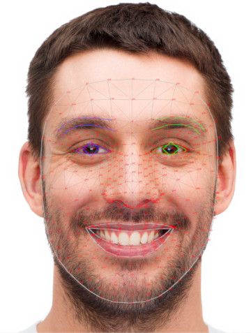

## Introduction

In the previous article [Face Detection](./face_detection.md), we introduced how to detect faces and a few keypoints (e.g., 5 keypoints). This article explains how to detect more keypoints.

More keypoints have a wide range of applications, such as expression detection, facial feature recognition, face swapping, and more.



<a href="../../assets/maixcam_face_landmarks_full.jpg" target="_blank">full size 478 landmarks image</a>

## Using Face Keypoints Detection in MaixPy

MaixPy integrates MediaPipe's **478 face keypoints** detection, with the results as shown below:


Video demonstration:
<video playsinline controls autoplay loop muted preload src="/static/video/maixcam_face_landmarks.mp4" type="video/mp4">
Classifier Result video
</video>

### Code Usage

To use this feature, MaixPy version must be >= 4.10.0. Refer to the latest code in [MaixPy/examples](https://github.com/sipeed/MaixPy):

```python
from maix import camera, display, image, nn, app

detect_conf_th = 0.5
detect_iou_th = 0.45
landmarks_conf_th = 0.5
landmarks_abs = True
landmarks_rel = False
max_face_num = 2
detector = nn.YOLOv8(model="/root/models/yolov8n_face.mud", dual_buff=False)
landmarks_detector = nn.FaceLandmarks(model="/root/models/face_landmarks.mud")

cam = camera.Camera(detector.input_width(), detector.input_height(), detector.input_format())
disp = display.Display()

while not app.need_exit():
    img = cam.read()
    results = []
    objs = detector.detect(img, conf_th=detect_conf_th, iou_th=detect_iou_th, sort=1)
    count = 0
    for obj in objs:
        img_std = landmarks_detector.crop_image(img, obj.x, obj.y, obj.w, obj.h, obj.points)
        if img_std:
            res = landmarks_detector.detect(img_std, landmarks_conf_th, landmarks_abs, landmarks_rel)
            if res and res.valid:
                results.append(res)
        count += 1
        if count >= max_face_num:
            break
    for res in results:
        landmarks_detector.draw_face(img, res.points, landmarks_detector.landmarks_num, res.points_z)
    disp.show(img)
```

### Explanation of Key Points

- `max_face_num`: Limits the maximum number of faces detected to prevent lag due to too many faces in the frame.
- `landmarks_abs`: Specifies the coordinates of face keypoints in the original `img`. The `points` variable contains 478 keypoints in the order `x0, y0, x1, y1, ..., x477, y477`.
- `landmarks_rel`: Outputs coordinates in `img_std` and appends the results to the `points` variable.
- `points_z`: Represents depth estimation of the keypoints relative to the face's center of gravity. The closer to the camera, the larger the value. If behind the face's center, the value is negative. The values are proportional to the face's width.
```

